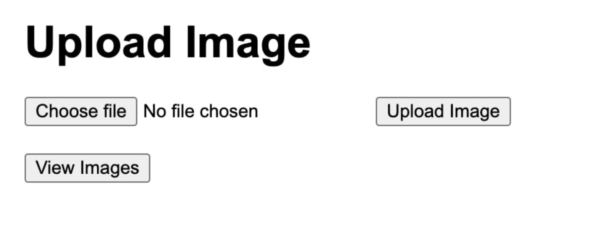

# image-uploader-service API documentation

## Table of Contents
- [Introduction](#introduction)
- [Features](#Features)
- [Endpoints](#API-Endpoints)
  - [Base URL](#Base_URL)
  - [Upload Image](#Upload-Image)
  - [List/view images](#List-Images)
- [Installation](#Installation)
- [Usage](#Usage)
- [Local testing](#Local-Testing)
- [Considerations](#Considerations)

# introduction
The image-uploader-service API allows user to upload image, resize them , list all uploaded images.
This API is useful for application that require image upload functionality with resizing capabilities.

# Features
- Upload images and resize them to a predefined width.
- List all uploaded images along with their URLs.

# API-Endpoints

# Base_URL

http://localhost:8080/api/

Once application is running refer to the below link for **API documentation**
    
    http://localhost:8080/apidocs/
# Upload-Image
Uploads an image to the server. The uploaded image is resized to a predefined width.

* URL: /submit
* Method: POST
* Request Body: Form data with a single field named file containing the image file.
* Success Response:
  *  Code: 201
  *  Content: {"message": "image uploaded successfully"}
* Error Responses:
  *  Code: 400
  *  Content: {"error": "no image file part in request"} or {"error": "no image file found"}
  *  Code: 500
  *  Content: {"error": "Error in resizing image: [error message]"}
# List-Images
- Retrieves a list of all uploaded images along with their URLs.

* URL: /list
* Method: GET
* Success Response:
  * Code: 200
  * Content:
  

    {
      "images": [
          {
              "filename": "sample.jpg",
              "url": "http://localhost:8080/images/sample.jpg"
          },
          ...
           ]
           }

* Error Response:
  * Code: 500
  * Content: {"error": "error listing images {str(e)}"}

# Installation
To run the Image Uploader Service locally, follow these steps:

1. Clone this repository to your local machine:
     

        git clone <repository_url>

2. Navigate to the project directory:

        cd image-uploader-service

3. Install the required dependencies using pip:

        pip install -r api/requirements.txt

# Usage
* For **backend** python start the Flask server by running the following command:
* python api/app.py
* Access the API endpoints using tools like cURL, Postman, or by integrating them into your application.
  * **Example cURL Commands**
    *  **Upload Image**: 
  
           curl -X POST -F "file=@/path/to/sample.jpg" http://localhost:8080/api/submit
    *  **List Images**:  
          
           curl -X GET http://localhost:8080/api/list

* For **Frontend** - UI go to the path 'ui/' then
  - Install Node.js (if not already installed)
  - Install http-server(is a lightweight, simple HTTP server module, making it ideal for development purposes or small-scale deployments where simplicity is prioritized): 
    'npm install http-server'
    * (alternatively, Nginx can be used in production environments due to its stability, performance, and extensive feature set.)
  - Run http-server: you can start the HTTP server by simply typing: http-server and ENTER.
    This command will start the server and serve files from the current directory on port 8081 (or according to port usage) by default.
  - Access your application: Once the server is running, you can access your application by opening a web browser and navigating to http://localhost:8081.

# Local-Testing
To test the API locally, follow these steps:

1. Make sure the Flask server is running (python app.py).
2. Use tools like cURL or Postman to send requests to the specified endpoints for backend API.
3. It's also easy to test the backend. Simply navigate to the API documentation page at http://localhost:8080/apidocs/ and test each API endpoint.
4. Verify the responses and functionality as per the documentation.
5. Afterward, test the frontend by selecting an image file and clicking the 'Upload Image' button. If successful, you can verify the uploaded file in the 'uploads' folder within the local code directory
   
6. To view all the uploaded images, click the 'View Images' button. It will display all the uploaded images

# Considerations
- To keep the application simple, considered using a local file store for storing images, opting to exclude storing them directly in PostgreSQL. 
- However, I also explored the option of saving images into the database and serving them from there (refer: `database` dir)
- Additionally, in terms of scalability and performance, options like cloud storage or S3 are better alternatives to store and serve images.
